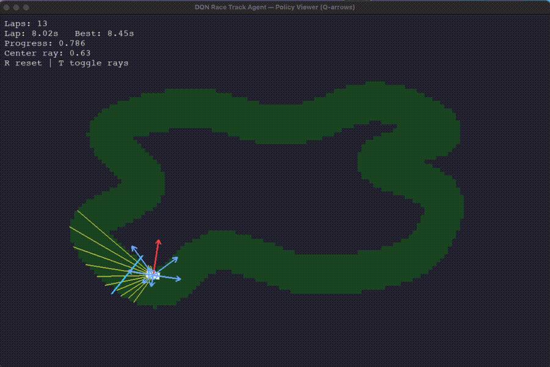

# 🏎️ Deep Q-Learning Autonomous Race Car

A custom-built reinforcement learning environment where a Deep Q-Network (DQN) agent learns to drive a physics-based race car around a 2D track using ray-based perception.

This project was built entirely from scratch to explore applied deep reinforcement learning, reward shaping, and environment design — without relying on OpenAI Gym or prebuilt simulators.

---

## 🎥 Demo

<p align="center">
  
</p>

The agent:
- Uses 13 ray sensors to detect track boundaries
- Controls throttle and steering through discrete actions
- Learns forward progress without checkpoints
- Avoids walls using reward shaping
- Completes full laps autonomously

Best lap time achieved:
**8.35 seconds**

---

## 🧠 What This Project Demonstrates

This project showcases:

- Custom reinforcement learning environment design
- Physics-based vehicle dynamics
- Ray-cast perception modeling
- Deep Q-Network implementation in PyTorch
- Experience replay
- Epsilon-greedy exploration with decay
- Reward shaping without artificial checkpoints
- Stable lap detection via geometric line intersection
- Training metric logging and model checkpointing

Everything — including collision detection, progress tracking, and lap completion logic — was engineered manually.

---

## 🏗️ Environment Design

### Observation Space (14 Dimensions)

Each state consists of:

- 13 normalized ray distances (0–1)
- 1 normalized vehicle speed

The agent receives only local sensory information — no global map knowledge.

---

### Action Space (9 Discrete Actions)

| Action | Behavior |
|--------|----------|
| 0 | Steer Left |
| 1 | Steer Right |
| 2 | Throttle Forward |
| 3 | Throttle Reverse |
| 4 | Forward + Left |
| 5 | Forward + Right |
| 6 | Reverse + Left |
| 7 | Reverse + Right |
| 8 | No Input |

---

## 🎯 Reward Design

Reward shaping was carefully tuned to encourage stable driving behavior:

- ✅ Positive reward for forward waypoint progress
- ➕ Small incentive for forward velocity
- ➖ Time penalty each step
- ➖ Penalty for proximity to walls
- ➖ Crash penalty
- 🎉 Lap completion bonus

Progress is calculated using closest waypoint indexing and normalized over the full track length.

Lap detection uses geometric start/finish line intersection — no artificial checkpoint hacks.

---

## 🧪 Training Configuration

- Algorithm: Deep Q-Network (DQN)
- Framework: PyTorch
- Device: Apple Metal (MPS acceleration)
- Replay Buffer: 50,000 transitions
- Training Steps: 50,000
- Physics timestep: Fixed 1/60s
- Epsilon: Linear decay from 1.0 → 0.05

Training sample output:

```
step=50000 eps=0.050 buffer=50000 laps=5 crashes=187
```

By the end of training, the agent consistently completes laps autonomously.

---

## ▶️ How To Run

### 1️⃣ Setup Environment

```bash
python -m venv .venv
source .venv/bin/activate
pip install -r requirements.txt
```

### 2️⃣ Train the Agent

```bash
python -m src.train_dqn
```

### 3️⃣ View Trained Policy

```bash
MODEL_PATH="runs/<timestamp>/dqn_final.pt" python -m src.main_view_policy
```

---

## 🧩 Engineering Challenges Solved

- Preventing reward exploitation from naive checkpoint systems
- Designing smooth, wrap-safe progress tracking
- Eliminating spinning and wall-hugging behavior
- Stabilizing DQN learning dynamics
- Ensuring consistent lap detection without false positives
- Handling no-progress and stuck termination conditions

---

## 🚀 Future Improvements

- Double DQN
- Prioritized Experience Replay
- PPO / Continuous control (DDPG)
- Procedurally generated tracks
- Curriculum learning
- Visual neural network input (CNN instead of rays)

---

## 📚 What I Learned

- How sensitive reinforcement learning is to reward design
- Why environment engineering matters more than the algorithm
- How DQN instability appears in practice
- How to debug agent behavior through structured logging
- The importance of geometric reasoning in simulation design

---

This project represents a complete reinforcement learning pipeline — from physics simulation to trained autonomous control.